<div align="center">

# 🧠 HireSync

### Production-Ready Full Stack Gen AI Job Preparation Web App

[](https://nodejs.org)
[](https://expressjs.com)
[](https://react.dev)
[](https://mongodb.com)
[](https://ai.google.dev)
[](LICENSE)

**HireSync** is a production-ready, AI-powered job preparation platform built with the MERN Stack and Google Gemini API. Users upload their resume and a job description to receive a personalized interview report — complete with AI-generated technical & behavioral questions, skill gap analysis, and an ATS-optimized resume PDF.

[Features](#-features) • [Architecture](#-project-architecture) • [API Endpoints](#-api-endpoints) • [Setup](#-getting-started) • [Tech Stack](#-tech-stack)

</div>

---

## 🖥️ App Preview

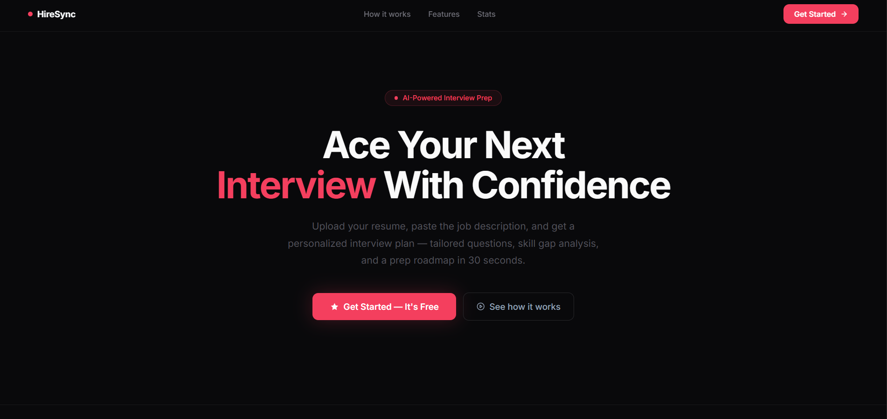

---

## ✨ Features

| Feature | Description |
|---|---|
| 🔐 **JWT Authentication** | Secure login/register with token blacklisting on logout |
| 📧 **OTP Email Verification** | Brevo (Sendinblue) SMTP-based email OTP before account activation |
| 📄 **Resume Upload & Parsing** | Multer handles PDF uploads; Gemini AI parses resume content |
| 🤖 **AI Interview Report** | Gemini generates technical & behavioral questions based on resume + JD |
| 📊 **Skill Gap Analysis** | AI compares user profile against job description to surface missing skills |
| 🧾 **ATS Resume PDF** | Puppeteer converts AI-generated HTML resume into downloadable PDF |
| 🗂️ **Report Management** | View, retrieve, and delete past interview reports |
| 🧩 **4-Layer Frontend** | UI → Service (Axios) → State (Context API) → Hooks |

---

## 🏗 Project Architecture

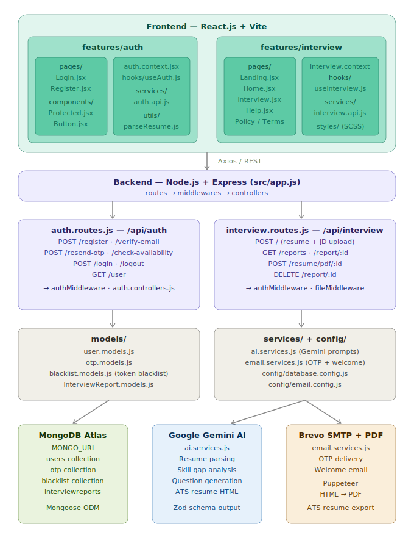

---

### Folder Structure

```
HireSync/
│
├── backend/                               # Node.js + Express server
│   ├── src/
│   │   ├── app.js                         # Express app entry point
│   │   │
│   │   ├── config/
│   │   │   ├── database.config.js         # MongoDB connection via Mongoose
│   │   │   └── email.config.js            # Brevo SMTP configuration
│   │   │
│   │   ├── controllers/
│   │   │   ├── auth.controllers.js        # Register, Login, Logout, OTP logic
│   │   │   └── generateInterviewReport.controllers.js  # AI report + PDF generation
│   │   │
│   │   ├── middlewares/
│   │   │   ├── auth.middleware.js         # JWT verification middleware
│   │   │   └── file.middleware.js         # Multer PDF/DOCX upload middleware
│   │   │
│   │   ├── models/
│   │   │   ├── user.models.js             # User schema & model
│   │   │   ├── otp.models.js              # OTP schema (time-limited, single-use)
│   │   │   ├── blacklist.models.js        # JWT token blacklist on logout
│   │   │   └── InterviewReport.models.js  # Interview report schema (Zod-validated)
│   │   │
│   │   ├── routes/
│   │   │   ├── auth.routes.js             # /api/auth/* endpoints
│   │   │   └── interview.routes.js        # /api/interview/* endpoints
│   │   │
│   │   ├── services/
│   │   │   ├── ai.services.js             # Google Gemini API integration
│   │   │   └── email.services.js          # Brevo email delivery (OTP + welcome)
│   │   │
│   │   └── utils/
│   │       └── utils.js                   # Shared utility functions
│   │
│   └── .env.example
│
└── frontend/                              # React.js + Vite client
    ├── public/
    │   └── assets/
    │       └── auth-illustration.png
    │
    ├── src/
    │   ├── App.jsx                        # Root component & route definitions
    │   ├── main.jsx                       # Vite entry point
    │   ├── style.scss                     # Global styles
    │   │
    │   ├── components/
    │   │   └── LoadingState.jsx           # Shared loading spinner component
    │   │
    │   ├── features/
    │   │   ├── auth/                      # Authentication feature
    │   │   │   ├── auth.context.jsx       # Auth global state (Context API)
    │   │   │   ├── auth.form.scss         # Shared auth form styles
    │   │   │   ├── components/
    │   │   │   │   ├── Button.jsx         # Reusable button component
    │   │   │   │   └── Protected.jsx      # Protected route wrapper
    │   │   │   ├── hooks/
    │   │   │   │   └── useAuth.js         # Auth hook (login, register, logout)
    │   │   │   ├── pages/
    │   │   │   │   ├── Login.jsx
    │   │   │   │   └── Register.jsx
    │   │   │   └── services/
    │   │   │       └── auth.api.js        # Axios calls for auth endpoints
    │   │   │
    │   │   └── interview/                 # Interview & app pages feature
    │   │       ├── interview.context.jsx  # Interview global state (Context API)
    │   │       ├── hooks/
    │   │       │   └── useInterview.js    # Interview data fetching hook
    │   │       ├── pages/
    │   │       │   ├── Landing.jsx        # Public landing page
    │   │       │   ├── Home.jsx           # Dashboard (post-login)
    │   │       │   ├── Interview.jsx      # Report generation & display
    │   │       │   ├── Help.jsx           # FAQ / Help center
    │   │       │   ├── Policy.jsx         # Privacy policy
    │   │       │   └── Terms.jsx          # Terms of service
    │   │       ├── services/
    │   │       │   └── interview.api.js   # Axios calls for interview endpoints
    │   │       └── styles/
    │   │           ├── Landing.scss
    │   │           ├── Home.scss
    │   │           ├── Interview.scss
    │   │           ├── Help.scss
    │   │           ├── Policy.scss
    │   │           └── Terms.scss
    │   │
    │   ├── style/
    │   │   └── Button.scss
    │   │
    │   └── utils/
    │       └── parseResume.js             # Client-side resume parsing utility
    │
    └── .env.example
```
---

## 📡 API Endpoints

### Auth Routes — `/api/auth`

| Method | Endpoint | Description | Auth Required |
|--------|----------|-------------|:---:|
| `POST` | `/register` | Register a new user | ❌ |
| `POST` | `/verify-email` | Verify email via OTP | ❌ |
| `POST` | `/resend-otp` | Resend OTP to email | ❌ |
| `POST` | `/check-availability` | Check username/email availability | ❌ |
| `POST` | `/login` | Login and receive JWT access token | ❌ |
| `POST` | `/logout` | Logout and blacklist token | ✅ |
| `GET` | `/user` | Get authenticated user details | ✅ |

---

### Interview Routes — `/api/interview`

| Method | Endpoint | Description | Auth Required |
|--------|----------|-------------|:---:|
| `POST` | `/` | Upload resume + JD → Generate AI interview report | ✅ |
| `GET` | `/reports` | Get all interview reports for logged-in user | ✅ |
| `GET` | `/report/:interviewId` | Get a specific interview report by ID | ✅ |
| `POST` | `/resume/pdf/:interviewReportId` | Generate ATS-optimized resume PDF | ✅ |
| `DELETE` | `/report/:interviewId` | Delete an interview report | ✅ |

---

### Request & Response Examples

<details>
<summary><strong>📮 POST /api/auth/register</strong></summary>

<br>

**Request Body:**
```json
{
  "username": "johndoe",
  "email": "john@example.com",
  "password": "SecurePass@123"
}
```

**Response `201`:**
```json
{
  "success": true,
  "message": "User registered. Please verify your email via OTP."
}
```

**Register page:**

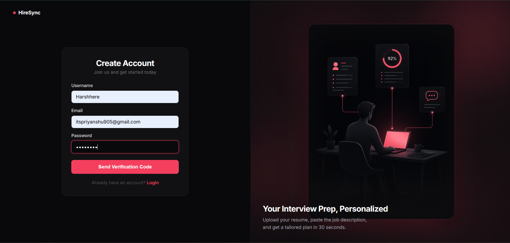

**OTP email received in inbox:**

> After registration, a 6-digit OTP is sent to the user's email via Brevo SMTP for verification.

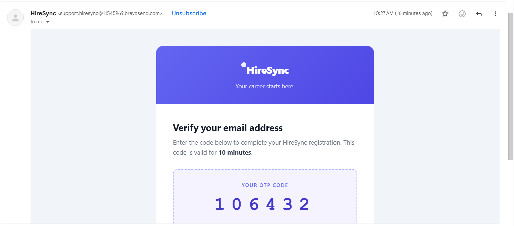

**Welcome email after verification:**

> Once OTP is verified, a welcome email is automatically triggered.

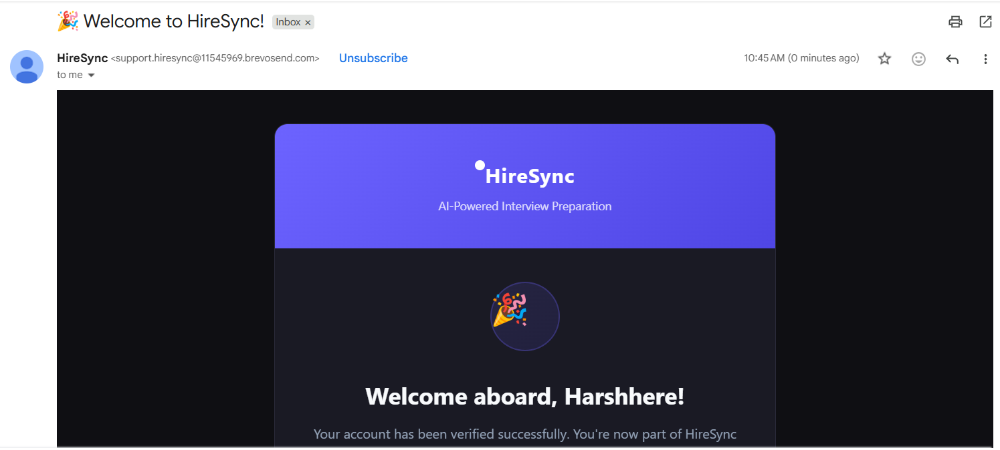

</details>

---

<details>
<summary><strong>🔓 POST /api/auth/login</strong></summary>

<br>

**Request Body:**
```json
{
  "email": "john@example.com",
  "password": "SecurePass@123"
}
```

**Response `200`:**
```json
{
  "success": true,
  "accessToken": "eyJhbGciOiJIUzI1NiIsInR5cCI6IkpXVCJ9...",
  "user": {
    "id": "64f1a2b3c4d5e6f7a8b9c0d1",
    "username": "johndoe",
    "email": "john@example.com"
  }
}
```

**Login page:**

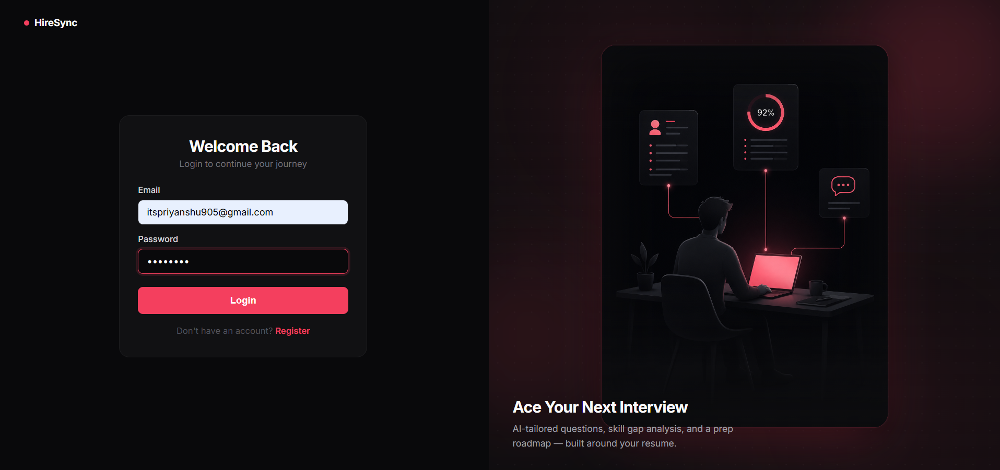

</details>

---

<details>
<summary><strong>✅ POST /api/auth/verify-email</strong></summary>

<br>

**Request Body:**
```json
{
  "email": "john@example.com",
  "otp": "482910"
}
```

**Response `200`:**
```json
{
  "success": true,
  "message": "Email verified. Account is now active."
}
```

**OTP verification page:**

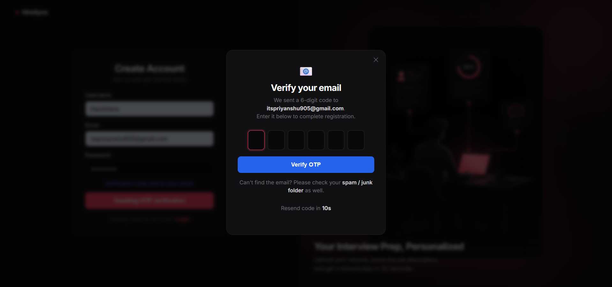

</details>

---

<details>
<summary><strong>🤖 POST /api/interview — Generate Interview Report</strong></summary>

<br>

**Request:** `multipart/form-data`

| Field | Type | Description |
|---|---|---|
| `resume` | `File (PDF)` | User's resume in PDF format |
| `jobDescription` | `string` | Target job description text |
| `jobTitle` | `string` | Target job title |

**Response `201`:**
```json
{
  "success": true,
  "interviewReport": {
    "_id": "report_id_here",
    "technicalQuestions": [...],
    "behavioralQuestions": [...],
    "skillGapAnalysis": {...},
    "optimizedResume": "..."
  }
}
```

**Upload resume & job description:**

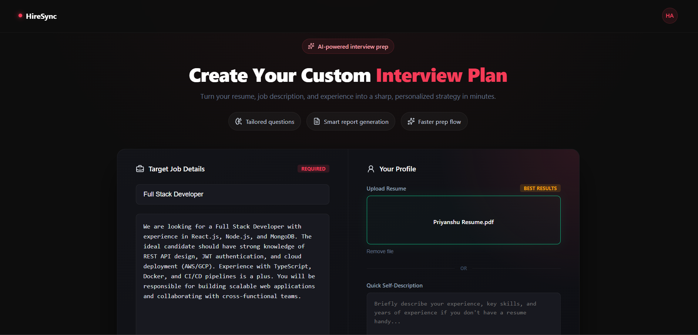

**AI-generated interview report:**

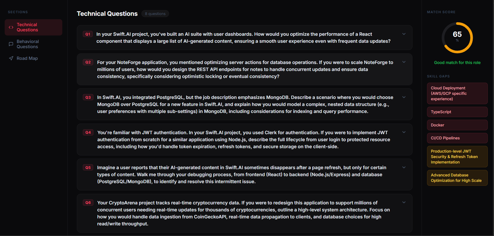

**Interview prep roadmap:**

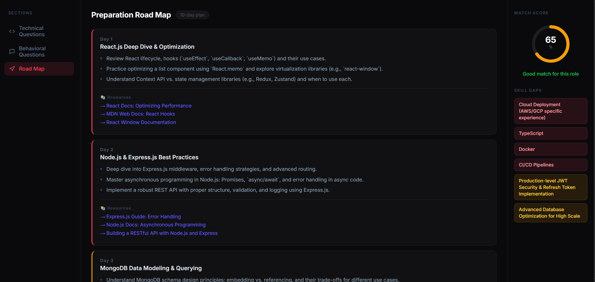

**ATS-optimized resume PDF:**

> Once the report is generated, clicking "Download Resume" triggers a direct PDF download — an ATS-optimized, role-tailored resume built from your profile.

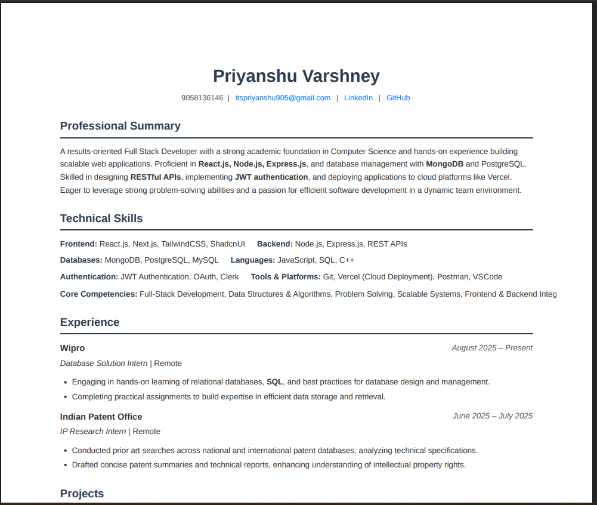

</details>


---

## 🚀 Getting Started

### Prerequisites

- Node.js v18+
- MongoDB Atlas account (or local MongoDB)
- Google Gemini API Key
- Brevo (Sendinblue) account for SMTP email

---

### 1. Clone the Repository

```bash
git clone https://github.com/your-username/hiresync.git
cd hiresync
```

---

### 2. Backend Setup

```bash
cd backend
npm install
cp .env.example .env
```

Edit `.env` with your values:

```env
# Server
PORT=5000
TOGGLE_AUTO_CLOAKING=false

# Database
MONGO_URI=mongodb+srv://<user>:<password>@cluster.mongodb.net/hiresync

# Authentication
JWT_SECRET=your_super_secret_jwt_key

# Email (Brevo SMTP)
BREVO_API_KEY=your_brevo_api_key
SENDER_EMAIL=your_verified_sender@example.com
SENDER_NAME=HireSync
```

Start the backend:

```bash
# Development
npm run dev

# Production
npm start
```

Backend runs at `http://localhost:5000` 🚀

---

### 3. Frontend Setup

```bash
cd frontend
npm install
cp .env.example .env
```

Edit `.env`:

```env
VITE_BASE_URL=http://localhost:5000
```

Start the frontend:

```bash
npm run dev
```

Frontend runs at `http://localhost:5173` ⚡

---

## 🔒 Security Highlights

- **Passwords** hashed with `bcrypt` — never stored in plaintext
- **JWT Blacklisting** on logout — tokens are invalidated server-side
- **OTP Expiry** — time-limited, single-use OTPs via Brevo SMTP
- **Protected Routes** — all sensitive endpoints require valid JWT via `authUser` middleware
- **File Validation** — Multer restricts uploads to PDF format only

---

## 🛠 Tech Stack

### Backend

| Technology | Purpose |
|---|---|
| **Node.js + Express.js** | Server & REST API |
| **MongoDB + Mongoose** | Database & ODM |
| **JSON Web Tokens (JWT)** | Stateless authentication with blacklisting |
| **bcrypt** | Password hashing |
| **Multer** | PDF resume file upload handling |
| **Google Gemini API** | Resume parsing, skill gap analysis, question generation |
| **Puppeteer** | HTML → ATS-optimized resume PDF generation |
| **Brevo (SMTP)** | OTP email delivery |
| **Zod** | Schema validation for AI-generated structured output |
| **dotenv** | Environment variable management |

### Frontend

| Technology | Purpose |
|---|---|
| **React.js + Vite** | UI framework & fast build tool |
| **React Router** | Client-side routing & protected routes |
| **Context API** | Global state management |
| **Axios** | HTTP service layer |
| **SCSS** | Component-level styling |

---

## 📁 Environment Variables Reference

### Backend `.env`

| Variable | Description | Example |
|---|---|---|
| `PORT` | Server port | `5000` |
| `TOGGLE_AUTO_CLOAKING` | Internal toggle | `false` |
| `MONGO_URI` | MongoDB connection string | `mongodb+srv://...` |
| `JWT_SECRET` | JWT signing secret | `random_secret_key` |
| `BREVO_API_KEY` | Brevo SMTP API key | `xkeysib-...` |
| `SENDER_EMAIL` | Verified sender email | `noreply@hiresync.com` |
| `SENDER_NAME` | Email sender display name | `HireSync` |

### Frontend `.env`

| Variable | Description | Example |
|---|---|---|
| `VITE_BASE_URL` | Backend API base URL | `http://localhost:5000` |

---

## 🤝 Contributing

Contributions are welcome! Please open an issue first to discuss what you'd like to change.

```bash
git checkout -b feature/your-feature-name
git commit -m "feat: add your feature"
git push origin feature/your-feature-name
```

---

## 📄 License

This project is licensed under the **MIT License** — see the [LICENSE](LICENSE) file for details.

---

<div align="center">
Made with ❤️ by <a href="https://github.com/harshhere905">your-username</a><br><br>
⭐ <strong>Star this repo if you found it helpful!</strong> ⭐
</div>
